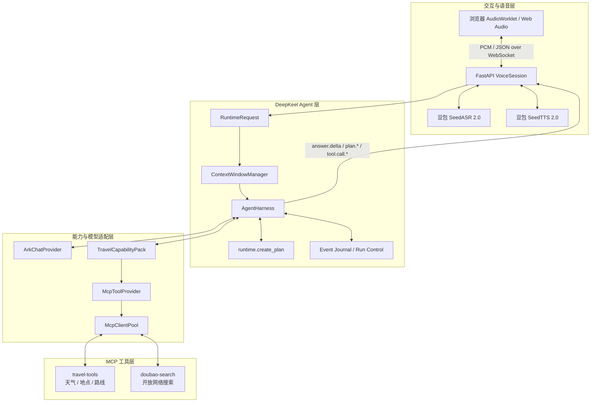

# 声旅：基于 DeepKeel 的流式语音旅行 Agent

声旅是一个基于 [DeepKeel](https://github.com/bufeibufei/deepkeel) 构建的中文语音旅行 Agent。浏览器持续上传 PCM 音频，豆包 SeedASR 生成流式转写；DeepKeel 在同一个 Agent 运行中完成上下文准备、任务规划、Function Calling、MCP 工具执行与答案综合；最终回答经豆包 SeedTTS 转换为流式语音并在浏览器中边生成边播放。

项目的重点不是简单串联 ASR、LLM 和 TTS，而是把 DeepKeel 作为应用的决策与执行核心：业务层不编写“天气问题调用天气工具”之类的意图路由，模型是否直接回答、调用哪个工具、是否创建计划以及如何综合工具结果，都由 DeepKeel Runtime 在受控的技能和工具边界内完成。


## DeepKeel 在应用中的位置



DeepKeel 与应用的结合分为四层：

| 分层 | 项目实现 | DeepKeel 职责 |
| --- | --- | --- |
| 会话适配层 | `VoiceSession` 将 ASR 最终文本封装为 `RuntimeRequest`，并把 Runtime 事件映射为 WebSocket 消息 | DeepKeel 不感知浏览器和音频协议，只接收结构化请求并输出事件流 |
| Agent 组装层 | `build_agent_runtime()` 注入模型 Provider、Capability Pack、Runtime Ports、默认 Skill 和运行限制 | `AgentHarness` 将这些组件组装成唯一的 Agent 执行入口 |
| 决策执行层 | 系统提示只声明行为约束，不在业务代码中硬编码意图分支 | Runtime 驱动模型原生 Function Calling、计划创建、参数校验、工具执行、重试和结果综合 |
| 能力接入层 | `TravelCapabilityPack` 声明技能、ToolSpec、规划策略和 MCP 映射 | Capability Pack 控制 Agent 可见能力，`McpToolProvider` 将本地工具名绑定到远端 MCP Server |

## 一个 Agent Turn 如何执行

1. `VoiceSession` 接收文字或 SeedASR 的最终转写，为当前会话生成 `thread_id`、`turn_id` 和 `run_id`，然后构造 DeepKeel `RuntimeRequest`。
2. `RetainedConversationContextWindowManager` 调用 DeepKeel 的确定性上下文窗口，合并最近消息与此前压缩出的会话摘要，使“我想去杭州旅行 → 两日游”这类省略表达能够继承上下文。
3. `AgentHarness.astream()` 激活 `voice-travel-assistant` Skill，并把该 Skill 允许使用的工具定义交给模型 Provider。
4. `ArkChatProvider` 将 DeepKeel Provider Contract 适配到火山方舟 Chat Completions，保留原生流式输出、tool calls 和并行工具调用语义。
5. 模型可以直接回答、调用单个工具，或调用 DeepKeel 内建的 `runtime.create_plan`。复杂任务的计划最多 6 步、允许 1 次修订、最多 3 个并行步骤，每步最多尝试 2 次。
6. 业务工具调用由 `McpToolProvider` 路由到对应的 stdio MCP Server。结构化结果返回 DeepKeel 后进入下一轮模型调用，由同一个 Agent 完成最终综合，而不是由 WebSocket 层拼接答案。
7. DeepKeel 持续产生 `plan.*`、`tool.call.*`、`answer.delta` 和 `runtime.settled` 等事件。会话层将答案增量同步给前端，并按完整语句送入 SeedTTS，实现文字与语音的并行流式输出。
8. 用户开始新一轮讲话时，会话层通过 `RunOperations` 请求取消当前 DeepKeel Run，同时停止 Agent task、TTS 会话和浏览器中尚未播放的音频，实现 barge-in。

这条链路中，`VoiceSession` 负责协议和生命周期，`AgentHarness` 负责决策和执行。两者之间只通过 `RuntimeRequest`、Runtime 事件以及 Run Control 交互，因此语音渠道可以替换成文本、电话或其他终端，而无需重写 Agent 核心。

## Agent 组装与扩展点

### Runtime Ports

项目通过 `RuntimePorts` 为 DeepKeel 注入以下基础设施：

- `InMemoryRuntimeStateStore`：保存 Run 状态；
- `InMemoryRuntimeEventJournal`：记录规划、工具和回答等运行事件；
- `InMemoryRunControl`：支持运行取消；
- `RetainedConversationContextWindowManager`：在不同 Run 之间保留 DeepKeel 压缩后的线程上下文；
- `planning_enabled=True`：启用 DeepKeel 规划能力；
- `system_prompt_factory`：为激活的 Skill 提供语音旅行助理约束。

这些端口都可以替换为持久化实现，而不改变 Agent、语音或 MCP 代码。

### Provider Adapter

`ArkChatProvider` 实现 DeepKeel 所需的 `complete_chat` 与 `stream_chat` 接口，将 Runtime 生成的 messages、tools 和 tool choice 转发到火山方舟。DeepKeel 只依赖 Provider Contract，因此更换语言模型时只需替换这一适配器，不需要修改 Capability Pack 或会话层。

项目同时提供确定性的 `DemoTravelProvider`。它不绕过 DeepKeel，而是同样返回标准 tool calls，并经过 DeepKeel 的规划、工具执行和结果综合链路，便于在没有外部模型凭据时验证 Runtime 行为。

### Capability Pack 与 Skill

`TravelCapabilityPack` 是业务能力的装配边界，集中完成三件事：

- 声明 `voice-travel-assistant` Skill 及其 `allowed_tools` 和 `planning_policy`；
- 使用 `ToolSpec` 定义工具名称、参数 Schema、只读属性、并行安全性和展示名称；
- 创建 `McpClientPool`，将本地稳定工具名绑定到不同 MCP Server 的远端工具名。

当前 Skill 可使用四个业务工具：

- `weather.get_weather`：查询当前或未来七天天气；
- `travel.search_places`：按城市和兴趣搜索地点；
- `travel.estimate_route`：估算城市间距离与耗时；
- `search.web_search`：通过火山官方豆包搜索查询新闻、公告和营业时间等开放网络信息。

要扩展新的 Agent 能力，可以在新的 Capability Pack 中声明 ToolSpec 和 Skill，再注册对应 Provider；无需把工具实现写进 Agent 循环。

## 多轮上下文

一个浏览器 WebSocket 对应一个 DeepKeel `thread_id`。会话层保留近期 user/assistant 消息，DeepKeel Context Window 负责裁剪、去重和压缩。由于每轮对话都是独立的 Run，`RetainedConversationContextWindowManager` 额外保存上一轮生成的 `conversation_summary`，并在下一轮 `prepare()` 时重新注入 `runtime_context`。

这种设计把两类状态分开：原始近期消息由渠道会话维护，压缩上下文由 DeepKeel Context Window 产生和管理。WebSocket 关闭后状态会被释放；生产环境可以把对应 Runtime Ports 替换为持久化存储。

## MCP 接入

MCP Pool 包含两个独立 stdio Server：

- `travel-tools`：项目内置服务，使用 Open-Meteo、Nominatim 和 OSRM 提供天气、地点与路线能力；
- `doubao-search`：通过 `uvx` 启动火山官方 `mcp-server-askecho-search-infinity`，返回结构化搜索结果。

`McpToolBinding` 隔离了 Agent 可见的本地工具名和 MCP Server 的远端工具名；搜索结果还会经过 normalization，统一为适合 Agent 消费的标题、站点、URL、摘要和发布时间。外部旅行数据源不可用时，工具结果会明确标记为 `fallback` 或 `unavailable`，系统提示要求 Agent 在最终回答中向用户说明。

## 流式语音链路

- 输入：AudioWorklet 采集浏览器音频，重采样为 PCM16/16 kHz，经 WebSocket 二进制帧持续上传；
- 识别：SeedASR 2.0 返回临时转写和最终文本，最终文本触发新的 DeepKeel Turn；
- 回答：DeepKeel 的 `answer.delta` 立即发送到浏览器，同时由 `SentenceChunker` 按语义完整的句子切分；
- 合成：完整句子持续追加到 SeedTTS 2.0，生成的 PCM16/24 kHz 音频帧原样转发；
- 播放：Web Audio API 对音频分片进行连续排程，减少分片间隙；
- 打断：新语音同时取消 DeepKeel Run、TTS 生成与前端播放队列。

## 快速运行

需要 Windows PowerShell、Git、Python 3.12 和 [uv](https://docs.astral.sh/uv/)。

```powershell
# 实时模式：在 .env 中配置火山方舟及豆包语音凭据
.\run.ps1

# 无外部模型凭据时验证 DeepKeel 规划和 MCP 调用链路
.\run.ps1 -Demo
```

浏览器打开 <http://127.0.0.1:8000>。点击“开始说话”进行语音对话，也可以使用文字输入验证完整 Agent 链路。首次使用麦克风时需要允许浏览器权限。

配置模板见 `.env.example`：

```dotenv
ARK_API_KEY=
ARK_MODEL=ark-code-latest
ARK_BASE_URL=https://ark.cn-beijing.volces.com/api/plan/v3
SPEECH_API_KEY=${ARK_API_KEY}
SPEECH_ASR_RESOURCE_ID=volc.seedasr.sauc.duration
SPEECH_TTS_RESOURCE_ID=seed-tts-2.0
SPEECH_VOICE=zh_female_vv_uranus_bigtts
VOICE_AGENT_DEMO_MODE=false
TRAVEL_MCP_OFFLINE=false
```

`.env` 已被 Git 忽略。不要把真实 Key 提交到仓库；如果 Key 曾出现在聊天或日志中，请在对应控制台轮换。

豆包搜索使用 `ASK_ECHO_SEARCH_INFINITY_API_KEY` 鉴权。默认配置会复用 `ARK_API_KEY`；如果账号体系使用不同凭据，应按控制台要求分别配置。

## 验证

```powershell
# 格式、静态检查和离线测试
.\verify.ps1

# 额外执行一次真实 TTS → ASR 闭环，会消耗语音额度
.\verify.ps1 -LiveSpeech
```

离线测试覆盖 DeepKeel 规划/工具/总结、上下文继承、MCP 降级数据、语音分句及 WebSocket 事件流。实时语音冒烟测试会先把一句中文合成为 PCM，再将音频流式送回 ASR，并校验最终转写。

## 项目结构

```text
backend/app/agent/   DeepKeel Runtime 组装、Provider Adapter、上下文与 Capability Pack
backend/app/voice/   豆包实时 ASR/TTS 与语音分句器
backend/app/api/     双向 WebSocket 会话、Runtime 事件映射与打断控制
travel_mcp/          可独立启动的 stdio MCP Server
frontend/            AudioWorklet、WebSocket 客户端和 PCM 流式播放
tests/               DeepKeel、MCP、上下文和协议自动化测试
scripts/             实时语音闭环冒烟测试
docs/                设计、协议、执行流程和演示说明
```

详细说明：[设计方案](docs/DESIGN.md) · [执行流程](docs/EXECUTION_FLOW.md) · [WebSocket/MCP 协议](docs/API.md) · [操作说明](docs/DEMO.md)

## Docker 部署

```bash
cp .env.example .env
# 在 .env 中填写服务端密钥，不要提交该文件
docker compose up -d --build
curl http://127.0.0.1:8020/health
```

容器默认只绑定服务器回环地址 `127.0.0.1:8020`，可以由 Nginx 反向代理页面、健康检查和 WebSocket。生产环境应配置 HTTPS，否则 Chrome 不会向公网 HTTP 页面开放麦克风。

仓库中的 `deploy/nginx-voice-agent.conf` 可嵌入现有 Nginx `server` 块，并关闭 WebSocket 代理缓冲以保证流式事件及时送达。

## 当前边界

- 默认 Runtime State、Event Journal 和对话上下文均保存在内存中；多实例部署应替换为共享的持久化 Runtime Ports；
- 当前 WebSocket 会话未实现用户身份认证，生产环境应增加鉴权、限流、音频时长限制、审计日志和指标告警；
- 天气、地点和路线依赖外部公共数据源；工具降级结果不能视为实时事实；
- 所有 MCP 工具均为只读，旅行规划不会执行购票、支付或预订。
