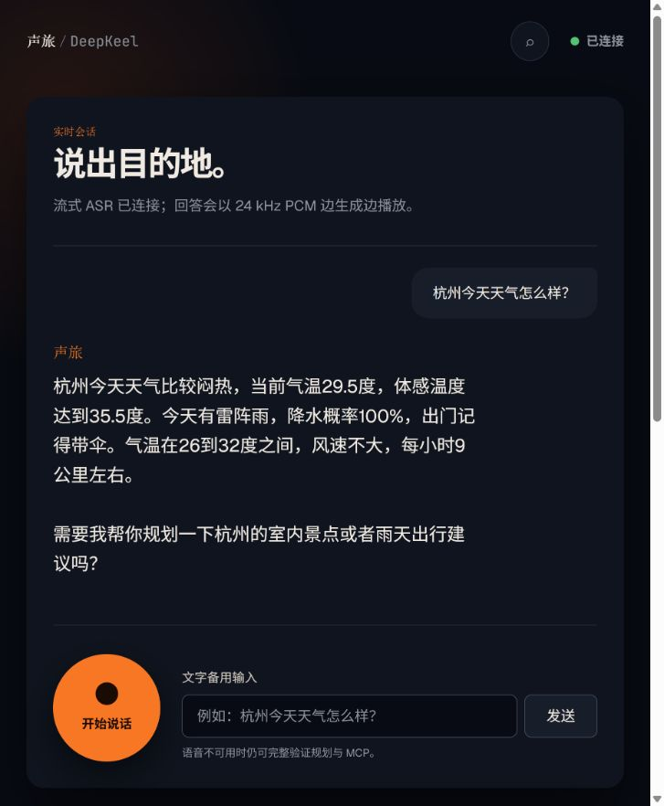

# 声旅：基于 DeepKeel 的流式语音旅行 Agent

一个可直接运行的中文语音交互应用：浏览器持续上传 PCM 音频，豆包 SeedASR 生成流式转写，DeepKeel 单 Agent 通过 function call 决定是否查询 MCP、是否建立计划，最后将回答分句送入豆包 TTS 并边生成边播放。LLM 和联网搜索统一使用火山方舟。



## 为什么 DeepKeel 可行

DeepKeel 4.1 已提供本题最关键的 Agent Runtime 能力：统一工具协议、原生 function call 循环、`runtime.create_plan` 规划工具、事件流、运行取消和 MCP Provider。项目没有在框架外伪造 Agent 判断：天气/地点/路线是否调用、复杂任务是否建计划，均由模型在 DeepKeel Runtime 内决定；WebSocket 层只负责语音和事件适配。

| 笔试要求 | 本项目实现 |
| --- | --- |
| 流式语音进入 | AudioWorklet 采集单声道音频，重采样为 PCM16/16 kHz，经 WebSocket 二进制帧持续上传 |
| 流式语音输出 | 回答按句送入豆包 TTS V3，PCM16/24 kHz 二进制帧边生成边播放 |
| 单 Agent 规划+总结 | DeepKeel `AgentHarness` + `planning_enabled` + `runtime.create_plan`，工具结果返回同一 Agent 综合 |
| Function call | 火山方舟 Chat Completions tool calls，由 DeepKeel 校验、执行、重试和记录事件 |
| MCP | 独立 stdio MCP Server，提供天气、地点、路线及豆包搜索四个只读工具 |
| 多轮上下文 | 会话内最近 12 条消息经 DeepKeel `recent_messages` 注入，支持“杭州旅行 → 两日游”等省略表达 |
| 可运行与展示 | FastAPI 单进程应用、离线 Demo 模式、自动化测试、一键 PowerShell 脚本和浏览器截图 |

## 快速运行

需要 Windows PowerShell、Git、Python 3.12 和 [uv](https://docs.astral.sh/uv/)。

```powershell
# Coding Plan 实时模式：配置 ARK_API_KEY，语音可复用同一枚 Key
.\run.ps1

# 没有 API Key 时也能完整演示 Agent 规划和 MCP 调用
.\run.ps1 -Demo
```

浏览器打开 <http://127.0.0.1:8000>。点击“开始说话”进行语音对话，也可以使用文字输入验证完整 Agent 链路。首次使用麦克风时需要允许浏览器权限。

在线体验：<http://8.162.12.47/voice-agent/>（公网 IP 的 HTTP 页面受浏览器安全策略限制，文字交互可直接体验；麦克风语音输入需通过 HTTPS 域名访问。）

配置来自 `.env`，模板见 `.env.example`：

```dotenv
ARK_API_KEY=
ARK_MODEL=ark-code-latest
ARK_BASE_URL=https://ark.cn-beijing.volces.com/api/plan/v3
SPEECH_API_KEY=${ARK_API_KEY}
SPEECH_ASR_RESOURCE_ID=volc.seedasr.sauc.duration
SPEECH_TTS_RESOURCE_ID=seed-tts-2.0
SPEECH_VOICE=zh_female_vv_uranus_bigtts
VOICE_AGENT_DEMO_MODE=false
TRAVEL_MCP_OFFLINE=false
```

`.env` 已被 Git 忽略。不要把真实 Key 提交到仓库；若 Key 曾出现在聊天或日志中，建议在对应控制台轮换。

本项目使用 Coding Plan 专用路径。当前 Plan Key 可同时用于 `ark-code-latest`、Responses、SeedASR 2.0 与 TTS 2.0，因此 `SPEECH_API_KEY` 可以通过 `${ARK_API_KEY}` 复用。标准方舟 Key 则应按各产品控制台的凭据规则配置，不能假定可互换。

豆包搜索通过火山官方 `mcp-server-askecho-search-infinity` 独立 stdio Server 接入，使用同一枚 Plan Key 注入 `ASK_ECHO_SEARCH_INFINITY_API_KEY`。它直接返回标题、站点、URL、摘要和发布时间等结构化搜索结果，不依赖语言模型的 Responses 内置工具。

## 验证

```powershell
# 格式、静态检查和离线测试
.\verify.ps1

# 额外执行一次真实 TTS → ASR 闭环（会消耗豆包语音额度）
.\verify.ps1 -LiveSpeech
```

离线测试不访问方舟、豆包语音或公网数据源，覆盖上下文继承、分句、MCP 降级数据、DeepKeel 规划/工具/总结及 WebSocket 事件流。实时语音冒烟脚本会先把一句中文合成为 PCM，再将音频流式送回 ASR，并校验得到最终转写。

## 项目结构

```text
backend/app/agent/   DeepKeel Runtime、方舟 Provider、MCP Capability Pack
backend/app/voice/   豆包实时 ASR/TTS 与语音分句器
backend/app/api/     双向 WebSocket 会话、事件映射、打断控制
travel_mcp/          可独立启动的 stdio MCP Server
frontend/            无构建步骤的响应式 Web UI、录音和 PCM 播放
tests/               离线自动化测试
scripts/             实时语音闭环冒烟测试
docs/                设计、协议、执行流程和演示说明
```

详细说明：[设计方案](docs/DESIGN.md) · [执行流程](docs/EXECUTION_FLOW.md) · [WebSocket/MCP 协议](docs/API.md) · [Demo 操作](docs/DEMO.md)

## Docker 部署

```bash
cp .env.example .env
# 在 .env 中填写服务端密钥，不要提交该文件
docker compose up -d --build
curl http://127.0.0.1:8020/health
```

容器仅绑定服务器回环地址 `127.0.0.1:8020`，由 Nginx 反向代理公开页面和 WebSocket。生产环境建议绑定域名并配置 HTTPS，否则 Chrome 不会向公网 HTTP 页面开放麦克风。

## 已知边界

- 天气使用 Open-Meteo，地点使用 Nominatim，路线使用 OSRM；外部源失败时 MCP 返回标记为 `fallback` 的保守演示数据，Agent 必须明确提示用户核验。
- 当前会话状态在内存中，适合笔试 Demo。生产化应替换 DeepKeel 的 state store/event journal，增加鉴权、限流、指标与 Key 托管。
- 多轮记忆目前按 WebSocket 会话保存最近 12 条消息；刷新页面会开始新会话，生产环境应持久化到用户/会话存储。
- 规划建议不执行购票、支付或预订，MCP 工具全部只读。
