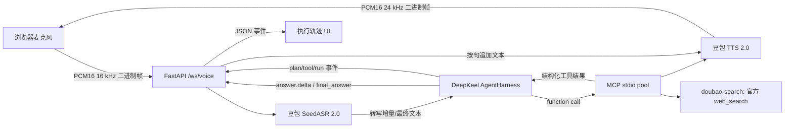

# 完整设计方案

## 1. 目标与取舍

目标不是把 ASR、LLM 和 TTS 串成固定流水线，而是让 DeepKeel 成为决策中心：模型能根据问题选择直接回答、一次工具调用，或建立多步骤计划；每个时效性事实必须来自 MCP；同一个 Agent 在工具结束后完成总结。前端只承担实时媒体传输与可观察性展示。

本实现选择 Python/FastAPI，因为 DeepKeel 与 MCP Python SDK 可以在同一事件循环里组合，豆包 SeedASR 原生支持 WebSocket。前端使用原生 Web Audio API，省去构建链和前端框架运行时，更适合可复现的笔试 Demo。

## 2. 架构

### 组件职责

- `ArkChatProvider`：把火山方舟 Chat Completions 适配成 DeepKeel provider contract，保留原生 tool calls 和 SSE 流。
- `AgentHarness`：唯一的决策循环，负责技能激活、规划、工具参数校验、并行调用、重试、取消和最终答案。
- `TravelCapabilityPack`：声明可见 ToolSpec、技能允许列表与 planning policy，并把本地名字绑定到远端 MCP 工具。
- `travel_mcp.server`：独立 stdio MCP 进程，不依赖 Web 应用内部对象；所有工具只读。
- `VoiceSession`：每个浏览器连接一个会话，序列化输出事件，桥接 ASR/Agent/TTS，并执行 barge-in。
- Web UI：AudioWorklet 采集，WebSocket 双向传输，Web Audio 排程播放，显示规划/工具/音频事件。

## 3. Agent 设计

技能 `voice-travel-assistant` 允许四个业务工具：

1. `weather.get_weather`：天气事实；
2. `travel.search_places`：按兴趣搜索地点；
3. `travel.estimate_route`：路线距离和耗时。
4. `search.web_search`：绑定火山官方 `mcp-server-askecho-search-infinity` 的 `web_search`，获取开放网络结构化结果。

复杂旅行问题还可使用 DeepKeel 内建的 `runtime.create_plan`。规划策略限制为最多 6 个步骤、1 次修订、3 个并行步骤、每步最多 2 次尝试。天气类简单问题只需一次 function call；两日行程等任务会创建计划，天气与地点可并行，路线完成后进入 synthesis。最终输出适合朗读，且不暴露内部推理和工具参数。

DeepKeel 某些规划路径会把最终内容放在 `runtime.result.final_answer`，而没有 token delta。适配层采用“原生 `answer.delta` 优先；否则将运行结果中的 `final_answer.markdown` 分片”的兼容策略，确保浏览器始终获得增量文本，并按标点将文本持续推给 TTS。

每个 WebSocket 会话维护最近 12 条 user/assistant 消息，并放入 `RuntimeRequest.context_bundle.recent_messages`。DeepKeel 的上下文窗口负责裁剪、去重并送入下一轮模型请求。`thread_id` 只用于标识线程，本身不会自动把不同 `run_id` 的消息恢复成模型上下文；这正是旧实现听到“杭州旅行”后仍无法理解“两日游”的原因。

## 4. MCP 数据与降级

MCP Pool 包含两个独立 stdio Server：本地 `travel-tools` 使用 Open-Meteo、Nominatim 和 OSRM；官方 `doubao-search` 由 `uvx` 启动 `mcp-server-askecho-search-infinity>=0.2.0`，以 `ASK_ECHO_SEARCH_INFINITY_API_KEY` 鉴权并直连豆包搜索 API。旅行数据网络失败时返回明确标记的降级结果，禁止伪装成实时数据。

## 5. 实时媒体协议

- 输入：浏览器音频通常为 44.1/48 kHz Float32；工作线程重采样到 16 kHz，转换为 little-endian PCM16 后分帧上传。
- ASR：使用 SeedASR 2.0 optimized bidirectional WebSocket 二进制协议；PCM 分片持续上行，临时结果用于字幕，最终帧触发 Agent turn。
- TTS：使用 Coding Plan 的豆包 TTS 2.0 V3 双向 WebSocket；回答完整句持续发送为 `TaskRequest`，服务返回 24 kHz PCM16 分片，后端原样转发。
- 播放：浏览器将 PCM 转 Float32 AudioBuffer，使用 `nextAt` 排程，避免分片之间出现空隙。
- 打断：检测到新的 `speech_started` 或用户按下麦克风时，同时请求 DeepKeel `RunOperations` 取消、取消 Agent task、发送 TTS cancel 并停止前端已排程音频。

## 6. 安全与生产化

API Key 只从服务器环境读取，不发送到浏览器；健康检查不泄露配置。MCP 工具只读且不执行预订。生产部署还应增加 WebSocket 身份认证、每用户并发/音频时长限制、HTTPS、密钥服务、可持久化 event journal、审计日志、指标告警以及外部 API 合规标识。
